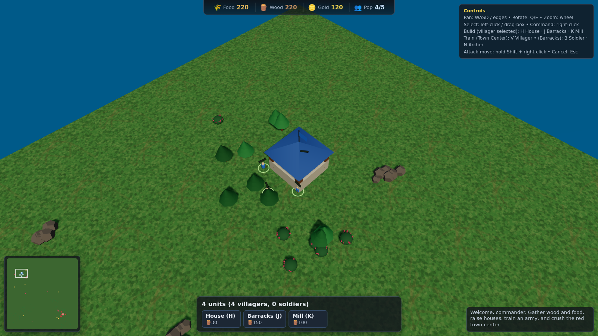

# Realm Conquest — 3D Browser RTS

A fully playable, Age-of-Empires-style **real-time strategy game** that runs
entirely in the browser in a **full 3D world**, rendered with **Three.js /
WebGL**. You start with a single Town Center and a handful of villagers; gather
resources, raise an economy, build an army, and destroy the enemy town center
before they destroy yours.



## Core loop

1. **Gather** — right-click villagers onto forests (🪵 wood), berry bushes
   (🌾 food) and gold ore (🪙 gold). They auto-haul to the nearest drop-off
   (Town Center or Mill) and keep working the seam.
2. **Expand** — with villagers selected, build **Houses** (raise the
   population cap), a **Mill** (closer food/wood drop-off) and a **Barracks**.
3. **Train** — the Town Center trains villagers; the Barracks trains
   **Soldiers** and **Archers**.
4. **Fight** — right-click an enemy to attack, or hold **Shift + right-click**
   to attack-move. Idle soldiers auto-engage nearby foes. The enemy AI trains
   troops and launches escalating raids.
5. **Win** — raze the red Town Center. Lose if yours falls.

## Run it

```bash
npm install
npm run dev          # Vite dev server → http://localhost:5173
```

Production build:

```bash
npm run build        # outputs to dist/
npm run preview      # serve the built bundle
```

## Controls

| Action               | Input                                   |
| -------------------- | --------------------------------------- |
| Pan camera           | `W A S D` / arrow keys / screen edges   |
| Rotate camera        | `Q` / `E` (or middle-mouse drag)        |
| Zoom                 | Mouse wheel                             |
| Select unit          | Left-click                              |
| Box-select           | Left-drag                               |
| Command (move/gather/build/attack) | Right-click               |
| Attack-move          | `Shift` + right-click                   |
| Build House / Barracks / Mill | `H` / `J` / `K` (villager selected) |
| Train Villager       | `V` (Town Center selected)              |
| Train Soldier / Archer | `B` / `N` (Barracks selected)         |
| Set rally point      | Right-click with a building selected    |
| Cancel placement     | `Esc`                                   |
| Minimap              | Left-click to jump, right-click to move |

## Play on the web / iPad

The game is a static site, so it deploys to **GitHub Pages** via
`.github/workflows/deploy.yml`. The workflow enables Pages on its first run
(source: GitHub Actions) — no manual setup needed. Every push to `main`
redeploys and the game is live at:

```
https://kjkfzpj.github.io/Realm/
```

Open that URL in Safari on the iPad. With a **Magic Keyboard** the controls map
directly: the keyboard handles panning/hotkeys and the trackpad handles
select/zoom, with a **two-finger (secondary) click** for the right-click
command. The page is configured (`touch-action`, locked viewport) so trackpad
gestures drive the game instead of scrolling Safari.

## Tech

- **Three.js (WebGL)** for the full-3D renderer — directional "sun" light with
  soft PCF shadows, hemisphere fill, ACES tone mapping and distance fog. All
  art is procedural geometry, so the game ships with **zero external assets**.
- **TypeScript** throughout, **Vite** for the dev server and bundle.
- A clean data → systems split: entities own their behaviour, the `Game`
  orchestrator owns state, economy, commands, combat and the enemy AI.

## Project layout

```
src/game/
  main.ts        # boot + game loop
  engine.ts      # renderer, scene, lighting rig, ground
  camera.ts      # RTS orbit/pan/zoom camera
  world.ts       # map generation (resources + starting bases)
  game.ts        # state, economy, commands, combat, enemy AI, win/lose
  entities.ts    # Unit / Building / ResourceNode (+ health bars, selection)
  factory.ts     # procedural meshes for everything
  input.ts       # selection, contextual orders, building placement
  hud.ts         # DOM HUD (resources, command card, log, overlay)
  minimap.ts     # 2D minimap
  config.ts      # all balance/tuning constants
```

## Automated verification

The renderer is exercised headlessly via Chromium (SwiftShader WebGL):

```bash
npm run smoke        # boots the game, runs commands, asserts state advances
npm run screenshot   # writes docs/screenshot-*.png
```

Both need Puppeteer, installed on demand so it stays out of the Pages build:

```bash
npm i -D puppeteer
```

> Note: this repository previously hosted a 2D city-builder prototype. That
> code still lives under `src/sim`, `src/render`, etc. but is no longer the
> app entry point — `index.html` now boots the 3D RTS in `src/game`.
